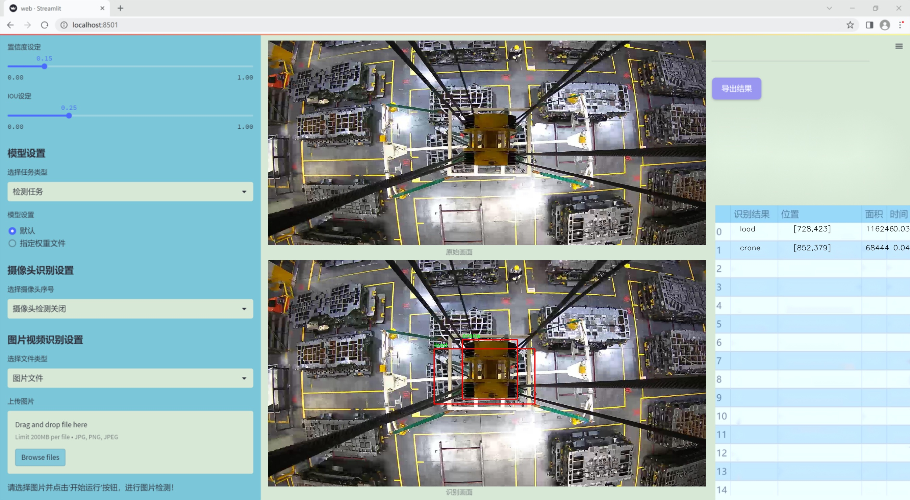
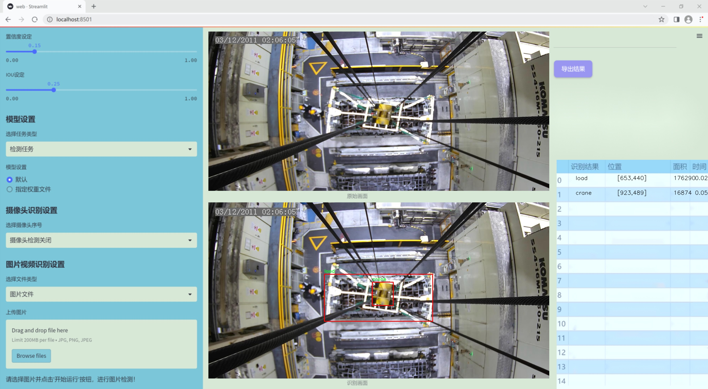
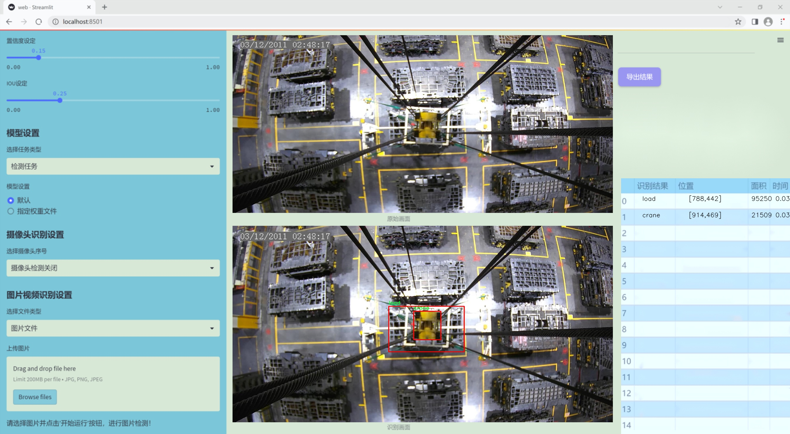
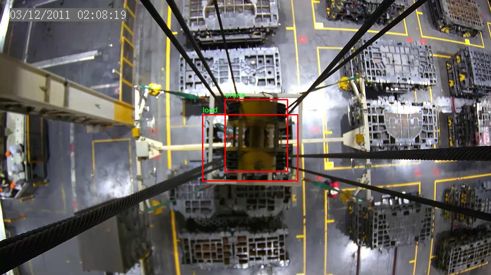
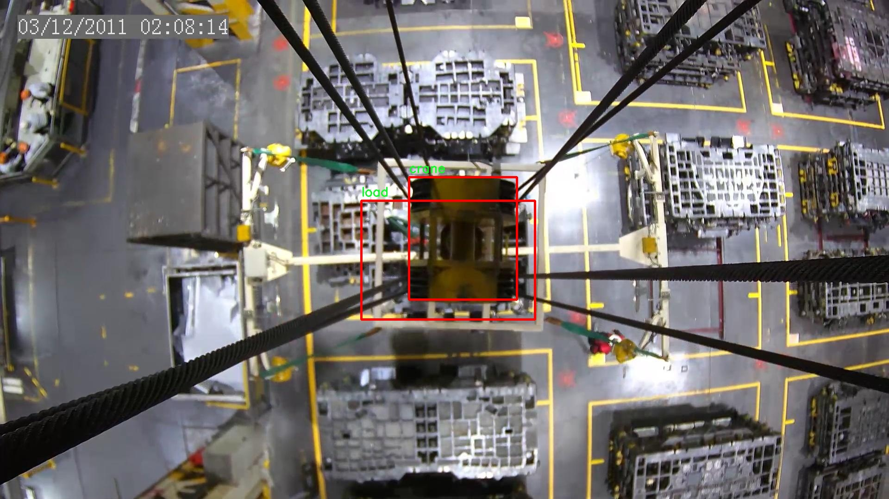
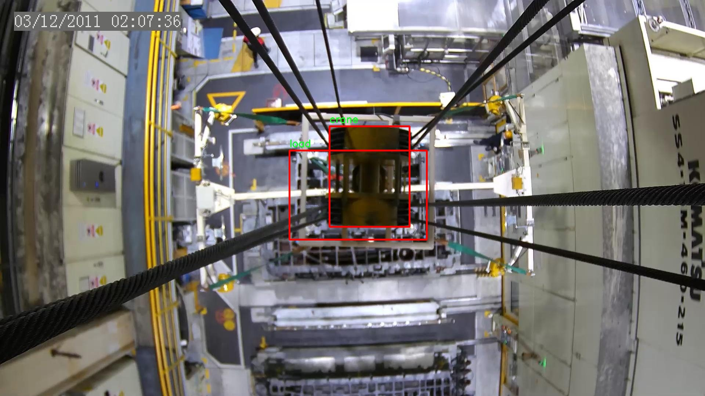
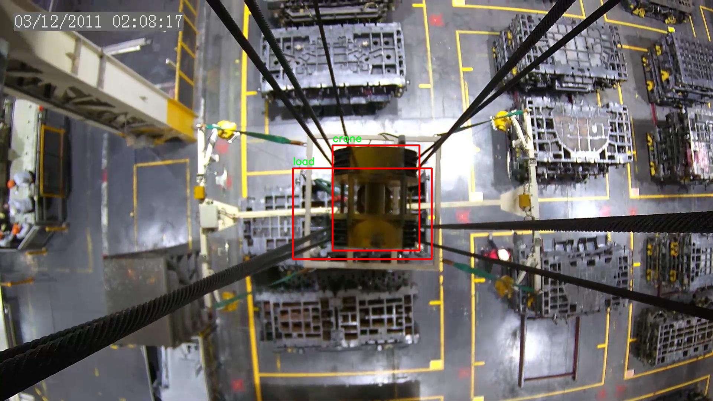
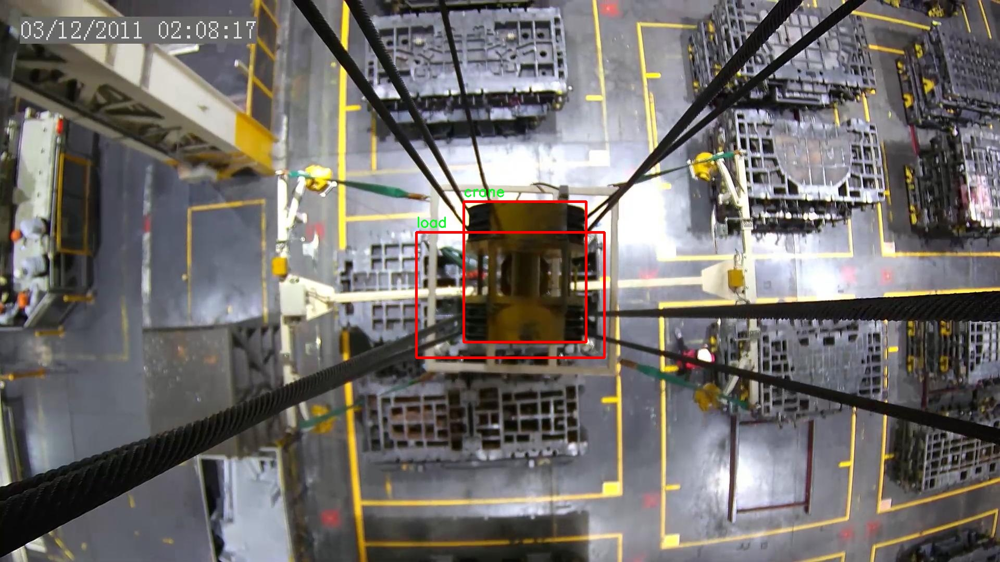

### 1.背景意义

研究背景与意义

随着工业自动化和智能化的快速发展，起重机在建筑、物流和制造等领域的应用愈发广泛。起重机的安全性和效率直接影响到生产过程的顺利进行，因此，如何实现对起重机及其载荷的实时检测与定位，成为了当前研究的热点之一。传统的检测方法往往依赖于人工监控，不仅效率低下，而且容易受到人为因素的影响，存在一定的安全隐患。因此，基于计算机视觉的自动检测系统应运而生。

在众多计算机视觉算法中，YOLO（You Only Look Once）系列因其高效的实时检测能力而备受关注。YOLOv11作为该系列的最新版本，具有更高的准确性和更快的处理速度，适合于复杂环境下的目标检测。然而，现有的YOLOv11模型在特定场景下的应用仍存在一定的局限性，尤其是在起重机与载荷的检测与定位方面。因此，改进YOLOv11以适应这一特定任务，具有重要的理论与实践意义。

本研究将基于一个包含2600张图像的数据集，该数据集专注于起重机和载荷的检测，旨在通过改进YOLOv11模型，提升其在该领域的检测精度和鲁棒性。通过对图像数据的深入分析和模型的优化调整，我们期望能够实现对起重机及其载荷的高效、准确定位。这不仅能够提高起重机的操作安全性，还能在一定程度上降低因操作失误导致的事故风险，从而推动相关行业的安全生产和智能化发展。最终，本研究的成果将为智能起重机系统的推广应用提供有力的技术支持，为行业的进步贡献新的思路与方法。

### 2.视频效果

[2.1 视频效果](https://www.bilibili.com/video/BV1VRDzYTEoH/)

### 3.图片效果







##### [项目涉及的源码数据来源链接](https://kdocs.cn/l/cszuIiCKVNis)**

注意：本项目提供训练的数据集和训练教程,由于版本持续更新,暂不提供权重文件（best.pt）,请按照6.训练教程进行训练后实现上图演示的效果。

### 4.数据集信息

##### 4.1 本项目数据集类别数＆类别名

nc: 2
names: ['crane', 'load']


该项目为【目标检测】数据集，请在【训练教程和Web端加载模型教程（第三步）】这一步的时候按照【目标检测】部分的教程来训练

##### 4.2 本项目数据集信息介绍

本项目数据集信息介绍

本项目所使用的数据集名为“vinc”，旨在为改进YOLOv11的起重机与载荷检测定位系统提供强有力的支持。该数据集包含两类主要对象，分别是“crane”（起重机）和“load”（载荷），共计类别数量为2。这一精简而明确的类别设置，使得模型在训练过程中能够专注于识别和定位这两种关键元素，从而提高检测的准确性和效率。

“vinc”数据集的构建过程充分考虑了实际应用场景，涵盖了多种不同环境下的起重机与载荷图像。这些图像不仅包括了不同类型和型号的起重机，还涉及了多种形状、尺寸和颜色的载荷，确保了数据集的多样性和代表性。此外，数据集中还包含了不同光照条件、天气状况和视角下的图像，以增强模型的鲁棒性和适应性。这种多样化的图像来源将有助于模型在实际应用中更好地应对各种复杂情况。

在数据标注方面，所有图像均经过精确标注，确保每个起重机和载荷的边界框位置准确无误。这一细致的标注工作为模型的训练提供了高质量的监督信号，使得YOLOv11能够在学习过程中有效捕捉到目标的特征。通过使用“vinc”数据集，研究团队期望能够显著提升起重机与载荷的检测精度，为后续的智能化施工和安全监控提供可靠的技术支持。

综上所述，“vinc”数据集不仅为本项目的研究提供了丰富的素材，还为改进YOLOv11的检测能力奠定了坚实的基础。通过对该数据集的深入分析和应用，研究团队相信能够在起重机与载荷检测领域取得突破性进展。











### 5.全套项目环境部署视频教程（零基础手把手教学）

[5.1 所需软件PyCharm和Anaconda安装教程（第一步）](https://www.bilibili.com/video/BV1BoC1YCEKi/?spm_id_from=333.999.0.0&vd_source=bc9aec86d164b67a7004b996143742dc)


[5.2 安装Python虚拟环境创建和依赖库安装视频教程（第二步）](https://www.bilibili.com/video/BV1ZoC1YCEBw?spm_id_from=333.788.videopod.sections&vd_source=bc9aec86d164b67a7004b996143742dc)

### 6.改进YOLOv11训练教程和Web_UI前端加载模型教程（零基础手把手教学）

[6.1 改进YOLOv11训练教程和Web_UI前端加载模型教程（第三步）](https://www.bilibili.com/video/BV1BoC1YCEhR?spm_id_from=333.788.videopod.sections&vd_source=bc9aec86d164b67a7004b996143742dc)


按照上面的训练视频教程链接加载项目提供的数据集，运行train.py即可开始训练



     Epoch   gpu_mem       box       obj       cls    labels  img_size
     1/200     20.8G   0.01576   0.01955  0.007536        22      1280: 100%|██████████| 849/849 [14:42<00:00,  1.04s/it]
               Class     Images     Labels          P          R     mAP@.5 mAP@.5:.95: 100%|██████████| 213/213 [01:14<00:00,  2.87it/s]
                 all       3395      17314      0.994      0.957      0.0957      0.0843

     Epoch   gpu_mem       box       obj       cls    labels  img_size
     2/200     20.8G   0.01578   0.01923  0.007006        22      1280: 100%|██████████| 849/849 [14:44<00:00,  1.04s/it]
               Class     Images     Labels          P          R     mAP@.5 mAP@.5:.95: 100%|██████████| 213/213 [01:12<00:00,  2.95it/s]
                 all       3395      17314      0.996      0.956      0.0957      0.0845

     Epoch   gpu_mem       box       obj       cls    labels  img_size
     3/200     20.8G   0.01561    0.0191  0.006895        27      1280: 100%|██████████| 849/849 [10:56<00:00,  1.29it/s]
               Class     Images     Labels          P          R     mAP@.5 mAP@.5:.95: 100%|███████   | 187/213 [00:52<00:00,  4.04it/s]
                 all       3395      17314      0.996      0.957      0.0957      0.0845


###### [项目数据集下载链接](https://kdocs.cn/l/cszuIiCKVNis)

### 7.原始YOLOv11算法讲解

YOLOv11是Ultralytics推出的YOLO系列最新版本，专为实现尖端的物体检测而设计。其架构和训练方法上进行了重大改进，使之不仅具备卓越的准确性和处理速度，还在计算效率上实现了一场革命。得益于其改进的主干和颈部架构，YOLOv11在特征提取和处理复杂任务时表现更加出色。在2024年9月27日，Ultralytics通过长达九小时的在线直播发布这一新作，展示了其在计算机视觉领域的革新。

YOLOv11通过精细的架构设计和优化训练流程，在保持高精度的同时，缩减了参数量，与YOLOv8m相比减少了22%的参数，使其在COCO数据集上的平均准确度（mAP）有所提升。这种效率的提高使YOLOv11非常适合部署在各种硬件环境中，包括边缘设备、云计算平台以及支持NVIDIA GPU的系统，确保在灵活性上的优势。

该模型支持广泛的任务，从对象检测、实例分割到图像分类、姿态估计和定向对象检测（OBB），几乎覆盖了计算机视觉的所有主要挑战。其创新的C3k2和C2PSA模块提升了网络深度和注意力机制的应用，提高了特征提取的效率和效果。同时，YOLOv11的改进网络结构也使之在复杂视觉任务上得以从容应对，成为各类计算机视觉任务的多功能选择。这些特性令YOLOv11在实施实时物体检测的各个领域中表现出众。
* * *

2024年9月27日，Ultralytics在线直播长达九小时，为YOLO11召开“发布会”

YOLO11 是 Ultralytics YOLO 系列实时物体检测器的最新版本，它以尖端的准确性、速度和效率重新定义了可能性。在之前 YOLO
版本的显著进步的基础上，YOLO11 在架构和训练方法方面进行了重大改进，使其成为各种计算机视觉任务的多功能选择。


##### YOLO11主要特点：

  * 增强的特征提取：YOLO11 采用了改进的主干和颈部架构，增强了特征提取能力，可实现更精确的对象检测和复杂任务性能。
  * 针对效率和速度进行了优化：YOLO11 引入了完善的架构设计和优化的训练流程，可提供更快的处理速度，并在准确度和性能之间保持最佳平衡。
  * 更少的参数，更高的准确度：借助模型设计的进步，YOLO11m 在 COCO 数据集上实现了更高的平均准确度 (mAP)，同时使用的参数比 YOLOv8m 少 22%，从而提高了计算效率，同时又不影响准确度。
  * 跨环境的适应性：YOLO11 可以无缝部署在各种环境中，包括边缘设备、云平台和支持 NVIDIA GPU 的系统，从而确保最大的灵活性。
  * 支持的任务范围广泛：无论是对象检测、实例分割、图像分类、姿势估计还是定向对象检测 (OBB)，YOLO11 都旨在满足各种计算机视觉挑战。

##### 支持的任务和模式

YOLO11 以 YOLOv8 中引入的多功能模型系列为基础，为各种计算机视觉任务提供增强的支持：

Model| Filenames| Task| Inference| Validation| Training| Export  
---|---|---|---|---|---|---  
YOLO11| yolol11n.pt, yolol11s.pt, yolol11m.pt, yolol11x.pt| Detection| ✅| ✅|
✅| ✅  
YOLO11-seg| yolol11n-seg.pt, yolol11s-seg.pt, yolol11m-seg.pt,
yolol11x-seg.pt| Instance Segmentation| ✅| ✅| ✅| ✅  
YOLO11-pose| yolol11n-pose.pt, yolol11s-pose.pt, yolol11m-pose.pt,
yolol11x-pose.pt| Pose/Keypoints| ✅| ✅| ✅| ✅  
YOLO11-obb| yolol11n-obb.pt, yolol11s-obb.pt, yolol11m-obb.pt,
yolol11x-obb.pt| Oriented Detection| ✅| ✅| ✅| ✅  
YOLO11-cls| yolol11n-cls.pt, yolol11s-cls.pt, yolol11m-cls.pt,
yolol11x-cls.pt| Classification| ✅| ✅| ✅| ✅  
  
##### 简单的 YOLO11 训练和推理示例

以下示例适用于用于对象检测的 YOLO11 Detect 模型。

    
    
    from ultralytics import YOLO
    
    # Load a model
    model = YOLO("yolo11n.pt")
    
    # Train the model
    train_results = model.train(
        data="coco8.yaml",  # path to dataset YAML
        epochs=100,  # number of training epochs
        imgsz=640,  # training image size
        device="cpu",  # device to run on, i.e. device=0 or device=0,1,2,3 or device=cpu
    )
    
    # Evaluate model performance on the validation set
    metrics = model.val()
    
    # Perform object detection on an image
    results = model("path/to/image.jpg")
    results[0].show()
    
    # Export the model to ONNX format
    path = model.export(format="onnx")  # return path to exported model

##### 支持部署于边缘设备

YOLO11 专为适应各种环境而设计，包括边缘设备。其优化的架构和高效的处理能力使其适合部署在边缘设备、云平台和支持 NVIDIA GPU
的系统上。这种灵活性确保 YOLO11 可用于各种应用，从移动设备上的实时检测到云环境中的复杂分割任务。有关部署选项的更多详细信息，请参阅导出文档。

##### YOLOv11 yaml文件

    
    
    # Ultralytics YOLO 🚀, AGPL-3.0 license
    # YOLO11 object detection model with P3-P5 outputs. For Usage examples see https://docs.ultralytics.com/tasks/detect
    
    # Parameters
    nc: 80 # number of classes
    scales: # model compound scaling constants, i.e. 'model=yolo11n.yaml' will call yolo11.yaml with scale 'n'
      # [depth, width, max_channels]
      n: [0.50, 0.25, 1024] # summary: 319 layers, 2624080 parameters, 2624064 gradients, 6.6 GFLOPs
      s: [0.50, 0.50, 1024] # summary: 319 layers, 9458752 parameters, 9458736 gradients, 21.7 GFLOPs
      m: [0.50, 1.00, 512] # summary: 409 layers, 20114688 parameters, 20114672 gradients, 68.5 GFLOPs
      l: [1.00, 1.00, 512] # summary: 631 layers, 25372160 parameters, 25372144 gradients, 87.6 GFLOPs
      x: [1.00, 1.50, 512] # summary: 631 layers, 56966176 parameters, 56966160 gradients, 196.0 GFLOPs
    
    # YOLO11n backbone
    backbone:
      # [from, repeats, module, args]
      - [-1, 1, Conv, [64, 3, 2]] # 0-P1/2
      - [-1, 1, Conv, [128, 3, 2]] # 1-P2/4
      - [-1, 2, C3k2, [256, False, 0.25]]
      - [-1, 1, Conv, [256, 3, 2]] # 3-P3/8
      - [-1, 2, C3k2, [512, False, 0.25]]
      - [-1, 1, Conv, [512, 3, 2]] # 5-P4/16
      - [-1, 2, C3k2, [512, True]]
      - [-1, 1, Conv, [1024, 3, 2]] # 7-P5/32
      - [-1, 2, C3k2, [1024, True]]
      - [-1, 1, SPPF, [1024, 5]] # 9
      - [-1, 2, C2PSA, [1024]] # 10
    
    # YOLO11n head
    head:
      - [-1, 1, nn.Upsample, [None, 2, "nearest"]]
      - [[-1, 6], 1, Concat, [1]] # cat backbone P4
      - [-1, 2, C3k2, [512, False]] # 13
    
      - [-1, 1, nn.Upsample, [None, 2, "nearest"]]
      - [[-1, 4], 1, Concat, [1]] # cat backbone P3
      - [-1, 2, C3k2, [256, False]] # 16 (P3/8-small)
    
      - [-1, 1, Conv, [256, 3, 2]]
      - [[-1, 13], 1, Concat, [1]] # cat head P4
      - [-1, 2, C3k2, [512, False]] # 19 (P4/16-medium)
    
      - [-1, 1, Conv, [512, 3, 2]]
      - [[-1, 10], 1, Concat, [1]] # cat head P5
      - [-1, 2, C3k2, [1024, True]] # 22 (P5/32-large)
    
      - [[16, 19, 22], 1, Detect, [nc]] # Detect(P3, P4, P5)
    

**YOLO11和YOLOv8 yaml文件的区别**


##### 改进模块代码

  * C3k2 

    
    
    class C3k2(C2f):
        """Faster Implementation of CSP Bottleneck with 2 convolutions."""
    
        def __init__(self, c1, c2, n=1, c3k=False, e=0.5, g=1, shortcut=True):
            """Initializes the C3k2 module, a faster CSP Bottleneck with 2 convolutions and optional C3k blocks."""
            super().__init__(c1, c2, n, shortcut, g, e)
            self.m = nn.ModuleList(
                C3k(self.c, self.c, 2, shortcut, g) if c3k else Bottleneck(self.c, self.c, shortcut, g) for _ in range(n)
            )

C3k2，它是具有两个卷积的CSP（Partial Cross Stage）瓶颈架构的更快实现。

**类继承：**

  * `C3k2`继承自类`C2f`。这表明`C2f`很可能实现了经过修改的基本CSP结构，而`C3k2`进一步优化或修改了此结构。

**构造函数（`__init__`）：**

  * `c1`：输入通道。

  * `c2`：输出通道。

  * `n`：瓶颈层数（默认为1）。

  * `c3k`：一个布尔标志，确定是否使用`C3k`块或常规`Bottleneck`块。

  * `e`：扩展比率，控制隐藏层的宽度（默认为0.5）。

  * `g`：分组卷积的组归一化参数或组数（默认值为 1）。

  * `shortcut`：一个布尔值，用于确定是否在网络中包含快捷方式连接（默认值为 `True`）。

**初始化：**

  * `super().__init__(c1, c2, n, short-cut, g, e)` 调用父类 `C2f` 的构造函数，初始化标准 CSP 组件，如通道数、快捷方式、组等。

**模块列表（`self.m`）：**

  * `nn.ModuleList` 存储 `C3k` 或 `Bottleneck` 模块，具体取决于 `c3k` 的值。

  * 如果 `c3k` 为 `True`，它会初始化 `C3k` 模块。`C3k` 模块接收以下参数：

  * `self.c`：通道数（源自 `C2f`）。

  * `2`：这表示在 `C3k` 块内使用了两个卷积层。

  * `shortcut` 和 `g`：从 `C3k2` 构造函数传递。

  * 如果 `c3k` 为 `False`，则初始化标准 `Bottleneck` 模块。

`for _ in range(n)` 表示将创建 `n` 个这样的块。

**总结：**

  * `C3k2` 实现了 CSP 瓶颈架构，可以选择使用自定义 `C3k` 块（具有两个卷积）或标准 `Bottleneck` 块，具体取决于 `c3k` 标志。

  * C2PSA

    
    
    class C2PSA(nn.Module):
        """
        C2PSA module with attention mechanism for enhanced feature extraction and processing.
    
        This module implements a convolutional block with attention mechanisms to enhance feature extraction and processing
        capabilities. It includes a series of PSABlock modules for self-attention and feed-forward operations.
    
        Attributes:
            c (int): Number of hidden channels.
            cv1 (Conv): 1x1 convolution layer to reduce the number of input channels to 2*c.
            cv2 (Conv): 1x1 convolution layer to reduce the number of output channels to c.
            m (nn.Sequential): Sequential container of PSABlock modules for attention and feed-forward operations.
    
        Methods:
            forward: Performs a forward pass through the C2PSA module, applying attention and feed-forward operations.
    
        Notes:
            This module essentially is the same as PSA module, but refactored to allow stacking more PSABlock modules.
    
        Examples:
            >>> c2psa = C2PSA(c1=256, c2=256, n=3, e=0.5)
            >>> input_tensor = torch.randn(1, 256, 64, 64)
            >>> output_tensor = c2psa(input_tensor)
        """
    
        def __init__(self, c1, c2, n=1, e=0.5):
            """Initializes the C2PSA module with specified input/output channels, number of layers, and expansion ratio."""
            super().__init__()
            assert c1 == c2
            self.c = int(c1 * e)
            self.cv1 = Conv(c1, 2 * self.c, 1, 1)
            self.cv2 = Conv(2 * self.c, c1, 1)
    
            self.m = nn.Sequential(*(PSABlock(self.c, attn_ratio=0.5, num_heads=self.c // 64) for _ in range(n)))
    
        def forward(self, x):
            """Processes the input tensor 'x' through a series of PSA blocks and returns the transformed tensor."""
            a, b = self.cv1(x).split((self.c, self.c), dim=1)
            b = self.m(b)
            return self.cv2(torch.cat((a, b), 1))

`C2PSA` 模块是一个自定义神经网络层，带有注意力机制，用于增强特征提取和处理。

**类概述**

  * **目的：**

  * `C2PSA` 模块引入了一个卷积块，利用注意力机制来改进特征提取和处理。

  * 它使用一系列 `PSABlock` 模块，这些模块可能代表某种形式的位置自注意力 (PSA)，并且该架构旨在允许堆叠多个 `PSABlock` 层。

**构造函数（`__init__`）：**

  * **参数：**

  * `c1`：输入通道（必须等于 `c2`）。

  * `c2`：输出通道（必须等于 `c1`）。

  * `n`：要堆叠的 `PSABlock` 模块数量（默认值为 1）。

  * `e`：扩展比率，用于计算隐藏通道的数量（默认值为 0.5）。

  * **属性：**

  * `self.c`：隐藏通道数，计算为 `int(c1 * e)`。

  * `self.cv1`：一个 `1x1` 卷积，将输入通道数从 `c1` 减少到 `2 * self.c`。这为将输入分成两部分做好准备。

  * `self.cv2`：另一个 `1x1` 卷积，处理后将通道维度恢复回 `c1`。

  * `self.m`：一系列 `PSABlock` 模块。每个 `PSABlock` 接收 `self.c` 通道，注意头的数量为 `self.c // 64`。每个块应用注意和前馈操作。

**前向方法：**

  * **输入：**

  * `x`，输入张量。

  * **操作：**

  1. `self.cv1(x)` 应用 `1x1` 卷积，将输入通道大小从 `c1` 减小到 `2 * self.c`。

  2. 生成的张量沿通道维度分为两部分，`a` 和 `b`。

  * `a`：第一个 `self.c` 通道。

  * `b`：剩余的 `self.c` 通道。

  1. `b` 通过顺序容器 `self.m`，它是 `PSABlock` 模块的堆栈。这部分经过基于注意的处理。

  2. 处理后的张量 `b` 与 `a` 连接。

  3. `self.cv2` 应用 `1x1` 卷积，将通道大小恢复为 `c1`。

  * **输出：**

  * 应用注意和卷积操作后的变换后的张量。

**总结：**

  * **C2PSA** 是一个增强型卷积模块，它通过堆叠的 `PSABlock` 模块应用位置自注意力。它拆分输入张量，将注意力应用于其中一部分，然后重新组合并通过最终卷积对其进行处理。此结构有助于从输入数据中提取复杂特征。

##### 网络结构


### 8.200+种全套改进YOLOV11创新点原理讲解

#### 8.1 200+种全套改进YOLOV11创新点原理讲解大全

由于篇幅限制，每个创新点的具体原理讲解就不全部展开，具体见下列网址中的改进模块对应项目的技术原理博客网址【Blog】（创新点均为模块化搭建，原理适配YOLOv5~YOLOv11等各种版本）

[改进模块技术原理博客【Blog】网址链接](https://gitee.com/qunmasj/good)


#### 8.2 精选部分改进YOLOV11创新点原理讲解

###### 这里节选部分改进创新点展开原理讲解(完整的改进原理见上图和[改进模块技术原理博客链接](https://gitee.com/qunmasj/good)【如果此小节的图加载失败可以通过CSDN或者Github搜索该博客的标题访问原始博客，原始博客图片显示正常】


#### 特征融合

模型架构图如下

  Darknet-53的特点可以这样概括：（Conv卷积模块+Residual Block残差块）串行叠加4次

  Conv卷积层+Residual Block残差网络就被称为一个stage


上面红色指出的那个，原始的Darknet-53里面有一层 卷积，在YOLOv11里面，把一层卷积移除了

为什么移除呢？

        原始Darknet-53模型中间加的这个卷积层做了什么？滤波器（卷积核）的个数从 上一个卷积层的512个，先增加到1024个卷积核，然后下一层卷积的卷积核的个数又降低到512个

        移除掉这一层以后，少了1024个卷积核，就可以少做1024次卷积运算，同时也少了1024个3×3的卷积核的参数，也就是少了9×1024个参数需要拟合。这样可以大大减少了模型的参数，（相当于做了轻量化吧）

        移除掉这个卷积层，可能是因为作者发现移除掉这个卷积层以后，模型的score有所提升，所以才移除掉的。为什么移除掉以后，分数有所提高呢？可能是因为多了这些参数就容易，参数过多导致模型在训练集删过拟合，但是在测试集上表现很差，最终模型的分数比较低。你移除掉这个卷积层以后，参数减少了，过拟合现象不那么严重了，泛化能力增强了。当然这个是，拿着你做实验的结论，反过来再找补，再去强行解释这种现象的合理性。


通过MMdetection官方绘制册这个图我们可以看到，进来的这张图片经过一个“Feature Pyramid Network(简称FPN)”，然后最后的P3、P4、P5传递给下一层的Neck和Head去做识别任务。 PAN（Path Aggregation Network）


“FPN是自顶向下，将高层的强语义特征传递下来。PAN就是在FPN的后面添加一个自底向上的金字塔，对FPN补充，将低层的强定位特征传递上去，

FPN是自顶（小尺寸，卷积次数多得到的结果，语义信息丰富）向下（大尺寸，卷积次数少得到的结果），将高层的强语义特征传递下来，对整个金字塔进行增强，不过只增强了语义信息，对定位信息没有传递。PAN就是针对这一点，在FPN的后面添加一个自底（卷积次数少，大尺寸）向上（卷积次数多，小尺寸，语义信息丰富）的金字塔，对FPN补充，将低层的强定位特征传递上去，又被称之为“双塔战术”。

FPN层自顶向下传达强语义特征，而特征金字塔则自底向上传达强定位特征，两两联手，从不同的主干层对不同的检测层进行参数聚合,这样的操作确实很皮。
#### 自底向上增强


而 PAN（Path Aggregation Network）是对 FPN 的一种改进，它的设计理念是在 FPN 后面添加一个自底向上的金字塔。PAN 引入了路径聚合的方式，通过将浅层特征图（低分辨率但语义信息较弱）和深层特征图（高分辨率但语义信息丰富）进行聚合，并沿着特定的路径传递特征信息，将低层的强定位特征传递上去。这样的操作能够进一步增强多尺度特征的表达能力，使得 PAN 在目标检测任务中表现更加优秀。


### Gold-YOLO简介
YOLO系列模型面世至今已有8年，由于其优异的性能，已成为目标检测领域的标杆。在系列模型经过十多个不同版本的改进发展逐渐稳定完善的今天，研究人员更多关注于单个计算模块内结构的精细调整，或是head部分和训练方法上的改进。但这并不意味着现有模式已是最优解。

当前YOLO系列模型通常采用类FPN方法进行信息融合，而这一结构在融合跨层信息时存在信息损失的问题。针对这一问题，我们提出了全新的信息聚集-分发（Gather-and-Distribute Mechanism）GD机制，通过在全局视野上对不同层级的特征进行统一的聚集融合并分发注入到不同层级中，构建更加充分高效的信息交互融合机制，并基于GD机制构建了Gold-YOLO。在COCO数据集中，我们的Gold-YOLO超越了现有的YOLO系列，实现了精度-速度曲线上的SOTA。


精度和速度曲线（TensorRT7）


精度和速度曲线（TensorRT8）
传统YOLO的问题
在检测模型中，通常先经过backbone提取得到一系列不同层级的特征，FPN利用了backbone的这一特点，构建了相应的融合结构：不层级的特征包含着不同大小物体的位置信息，虽然这些特征包含的信息不同，但这些特征在相互融合后能够互相弥补彼此缺失的信息，增强每一层级信息的丰富程度，提升网络性能。

原始的FPN结构由于其层层递进的信息融合模式，使得相邻层的信息能够充分融合，但也导致了跨层信息融合存在问题：当跨层的信息进行交互融合时，由于没有直连的交互通路，只能依靠中间层充当“中介”进行融合，导致了一定的信息损失。之前的许多工作中都关注到了这一问题，而解决方案通常是通过添加shortcut增加更多的路径，以增强信息流动。

然而传统的FPN结构即便改进后，由于网络中路径过多，且交互方式不直接，基于FPN思想的信息融合结构仍然存在跨层信息交互困难和信息损失的问题。

#### Gold-YOLO：全新的信息融合交互机制


#### Gold-YOLO架构
参考该博客提出的一种全新的信息交互融合机制：信息聚集-分发机制(Gather-and-Distribute Mechanism)。该机制通过在全局上融合不同层次的特征得到全局信息，并将全局信息注入到不同层级的特征中，实现了高效的信息交互和融合。在不显著增加延迟的情况下GD机制显著增强了Neck部分的信息融合能力，提高了模型对不同大小物体的检测能力。

GD机制通过三个模块实现：信息对齐模块(FAM)、信息融合模块(IFM)和信息注入模块(Inject)。

信息对齐模块负责收集并对齐不同层级不同大小的特征

信息融合模块通过使用卷积或Transformer算子对对齐后的的特征进行融合，得到全局信息

信息注入模块将全局信息注入到不同层级中

在Gold-YOLO中，针对模型需要检测不同大小的物体的需要，并权衡精度和速度，我们构建了两个GD分支对信息进行融合：低层级信息聚集-分发分支(Low-GD)和高层级信息聚集-分发分支(High-GD)，分别基于卷积和transformer提取和融合特征信息。

此外,为了促进局部信息的流动，我们借鉴现有工作，构建了一个轻量级的邻接层融合模块，该模块在局部尺度上结合了邻近层的特征，进一步提升了模型性能。我们还引入并验证了预训练方法对YOLO模型的有效性，通过在ImageNet 1K上使用MAE方法对主干进行预训练，显著提高了模型的收敛速度和精度。


### 9.系统功能展示

图9.1.系统支持检测结果表格显示

  图9.2.系统支持置信度和IOU阈值手动调节

  图9.3.系统支持自定义加载权重文件best.pt(需要你通过步骤5中训练获得)

  图9.4.系统支持摄像头实时识别

  图9.5.系统支持图片识别

  图9.6.系统支持视频识别

  图9.7.系统支持识别结果文件自动保存

  图9.8.系统支持Excel导出检测结果数据


### 10. YOLOv11核心改进源码讲解

#### 10.1 VanillaNet.py

以下是经过简化和注释的核心代码，保留了最重要的部分，并对每个部分进行了详细的中文注释：

```python
import torch
import torch.nn as nn
import torch.nn.functional as F
from timm.layers import weight_init

# 定义激活函数类
class Activation(nn.ReLU):
    def __init__(self, dim, act_num=3, deploy=False):
        super(Activation, self).__init__()
        self.deploy = deploy
        # 初始化权重
        self.weight = torch.nn.Parameter(torch.randn(dim, 1, act_num * 2 + 1, act_num * 2 + 1))
        self.bias = None
        self.bn = nn.BatchNorm2d(dim, eps=1e-6)  # 批归一化
        self.dim = dim
        self.act_num = act_num
        weight_init.trunc_normal_(self.weight, std=.02)  # 权重初始化

    def forward(self, x):
        # 前向传播
        if self.deploy:
            return F.conv2d(
                super(Activation, self).forward(x), 
                self.weight, self.bias, padding=(self.act_num * 2 + 1) // 2, groups=self.dim)
        else:
            return self.bn(F.conv2d(
                super(Activation, self).forward(x),
                self.weight, padding=self.act_num, groups=self.dim))

    def switch_to_deploy(self):
        # 切换到部署模式，融合BN层
        if not self.deploy:
            kernel, bias = self._fuse_bn_tensor(self.weight, self.bn)
            self.weight.data = kernel
            self.bias = torch.nn.Parameter(torch.zeros(self.dim))
            self.bias.data = bias
            self.__delattr__('bn')  # 删除bn属性
            self.deploy = True

    def _fuse_bn_tensor(self, weight, bn):
        # 融合权重和批归一化层
        kernel = weight
        running_mean = bn.running_mean
        running_var = bn.running_var
        gamma = bn.weight
        beta = bn.bias
        eps = bn.eps
        std = (running_var + eps).sqrt()
        t = (gamma / std).reshape(-1, 1, 1, 1)
        return kernel * t, beta + (0 - running_mean) * gamma / std

# 定义网络块
class Block(nn.Module):
    def __init__(self, dim, dim_out, act_num=3, stride=2, deploy=False):
        super().__init__()
        self.deploy = deploy
        if self.deploy:
            self.conv = nn.Conv2d(dim, dim_out, kernel_size=1)  # 部署模式下的卷积
        else:
            self.conv1 = nn.Sequential(
                nn.Conv2d(dim, dim, kernel_size=1),
                nn.BatchNorm2d(dim, eps=1e-6),
            )
            self.conv2 = nn.Sequential(
                nn.Conv2d(dim, dim_out, kernel_size=1),
                nn.BatchNorm2d(dim_out, eps=1e-6)
            )
        self.pool = nn.MaxPool2d(stride) if stride != 1 else nn.Identity()  # 池化层
        self.act = Activation(dim_out, act_num)  # 激活函数

    def forward(self, x):
        # 前向传播
        if self.deploy:
            x = self.conv(x)
        else:
            x = self.conv1(x)
            x = F.leaky_relu(x, negative_slope=1)  # 使用Leaky ReLU激活
            x = self.conv2(x)

        x = self.pool(x)  # 池化
        x = self.act(x)  # 激活
        return x

    def switch_to_deploy(self):
        # 切换到部署模式
        if not self.deploy:
            kernel, bias = self._fuse_bn_tensor(self.conv1[0], self.conv1[1])
            self.conv = self.conv2[0]  # 选择第二个卷积层
            self.conv.weight.data = kernel
            self.conv.bias.data = bias
            self.__delattr__('conv1')
            self.__delattr__('conv2')
            self.act.switch_to_deploy()  # 切换激活函数
            self.deploy = True

# 定义主网络结构
class VanillaNet(nn.Module):
    def __init__(self, in_chans=3, num_classes=1000, dims=[96, 192, 384, 768], strides=[2, 2, 2, 1], deploy=False):
        super().__init__()
        self.deploy = deploy
        if self.deploy:
            self.stem = nn.Sequential(
                nn.Conv2d(in_chans, dims[0], kernel_size=4, stride=4),
                Activation(dims[0])
            )
        else:
            self.stem1 = nn.Sequential(
                nn.Conv2d(in_chans, dims[0], kernel_size=4, stride=4),
                nn.BatchNorm2d(dims[0], eps=1e-6),
            )
            self.stem2 = nn.Sequential(
                nn.Conv2d(dims[0], dims[0], kernel_size=1, stride=1),
                nn.BatchNorm2d(dims[0], eps=1e-6),
                Activation(dims[0])
            )

        self.stages = nn.ModuleList()
        for i in range(len(strides)):
            stage = Block(dim=dims[i], dim_out=dims[i + 1], stride=strides[i], deploy=deploy)
            self.stages.append(stage)  # 添加网络块

    def forward(self, x):
        # 前向传播
        if self.deploy:
            x = self.stem(x)
        else:
            x = self.stem1(x)
            x = F.leaky_relu(x, negative_slope=1)
            x = self.stem2(x)

        for stage in self.stages:
            x = stage(x)  # 逐层通过网络块
        return x

    def switch_to_deploy(self):
        # 切换到部署模式
        if not self.deploy:
            self.stem2[2].switch_to_deploy()  # 切换激活函数
            self.deploy = True

# 创建模型实例的函数
def vanillanet_10(pretrained='', **kwargs):
    model = VanillaNet(dims=[128 * 4, 128 * 4, 256 * 4, 512 * 4, 512 * 4, 512 * 4, 512 * 4, 1024 * 4], **kwargs)
    if pretrained:
        weights = torch.load(pretrained)['model_ema']
        model.load_state_dict(weights)  # 加载预训练权重
    return model

if __name__ == '__main__':
    inputs = torch.randn((1, 3, 640, 640))  # 输入数据
    model = vanillanet_10()  # 创建模型
    pred = model(inputs)  # 前向传播
    for i in pred:
        print(i.size())  # 输出每层的尺寸
```

### 代码说明：
1. **Activation类**：实现了自定义的激活函数，支持训练和部署模式，并融合了批归一化。
2. **Block类**：表示网络中的一个基本块，包含卷积层、池化层和激活函数。
3. **VanillaNet类**：主网络结构，包含多个Block，负责前向传播和权重加载。
4. **vanillanet_10函数**：用于创建VanillaNet模型的实例，并可选择加载预训练权重。
5. **主程序**：创建输入数据，实例化模型并进行前向传播，输出每层的尺寸。

该文件 `VanillaNet.py` 实现了一个名为 VanillaNet 的深度学习模型，主要用于图像处理任务。该模型基于 PyTorch 框架构建，包含多个模块和功能，以下是对其代码的逐步分析和说明。

首先，文件中包含了版权声明和许可证信息，表明该程序是自由软件，可以在 MIT 许可证下进行再分发和修改。接着，导入了必要的库，包括 PyTorch 和一些用于初始化权重的函数。

接下来，定义了一个名为 `activation` 的类，继承自 `nn.ReLU`。这个类的主要功能是实现一种自定义的激活函数，包含了权重和偏置的初始化，以及在前向传播时的不同处理方式（如部署模式和训练模式）。在 `forward` 方法中，根据是否处于部署模式，选择不同的卷积操作。该类还实现了批归一化的融合方法，以便在模型部署时减少计算量。

然后，定义了一个名为 `Block` 的类，表示模型中的基本构建块。这个类的构造函数中根据输入和输出维度、步幅和是否处于部署模式来初始化卷积层和池化层。`forward` 方法中实现了前向传播的逻辑，处理输入数据并通过卷积和激活函数生成输出。该类同样实现了批归一化的融合方法和切换到部署模式的功能。

接下来，定义了 `VanillaNet` 类，这是整个模型的核心。构造函数中根据输入通道数、类别数、各层的维度、丢弃率、激活函数数量、步幅等参数初始化模型的结构。模型的前向传播方法会依次通过各个阶段（即 `Block`），并在适当的尺度下保存特征图。

此外，模型还包含了一些辅助方法，例如 `_init_weights` 用于初始化权重，`change_act` 用于修改激活函数的学习率，`switch_to_deploy` 用于将模型切换到部署模式。

文件中还定义了一些函数，如 `update_weight` 用于更新模型的权重，`vanillanet_5` 到 `vanillanet_13_x1_5_ada_pool` 函数用于创建不同配置的 VanillaNet 模型，并可选择加载预训练权重。

最后，在文件的主程序部分，创建了一个输入张量并实例化了 `vanillanet_10` 模型，进行前向传播并打印输出特征图的尺寸。

总体来说，该文件实现了一个灵活且高效的卷积神经网络模型，支持多种配置和预训练权重的加载，适用于图像分类等任务。通过自定义的激活函数和模块化的设计，模型在训练和部署时都能保持高效性。

#### 10.2 cfpt.py

以下是经过简化和注释的核心代码部分，主要保留了 `CrossLayerSpatialAttention` 和 `CrossLayerChannelAttention` 类的实现，以及与其相关的关键方法和类。

```python
import torch
import math
import torch.nn as nn
import torch.nn.functional as F

class LayerNormProxy(nn.Module):
    """自定义的LayerNorm代理，用于处理通道维度的归一化"""
    def __init__(self, dim):
        super().__init__()
        self.norm = nn.LayerNorm(dim)

    def forward(self, x):
        # 将输入的形状从 (B, C, H, W) 转换为 (B, H, W, C)
        x = x.permute(0, 2, 3, 1)
        x = self.norm(x)  # 进行LayerNorm
        # 将形状转换回 (B, C, H, W)
        return x.permute(0, 3, 1, 2)

class CrossLayerPosEmbedding3D(nn.Module):
    """跨层位置嵌入，计算相对位置偏置"""
    def __init__(self, num_heads=4, window_size=(5, 3, 1), spatial=True):
        super(CrossLayerPosEmbedding3D, self).__init__()
        self.spatial = spatial
        self.num_heads = num_heads
        self.window_size = window_size

        # 初始化相对位置偏置表
        self.relative_position_bias_table = nn.Parameter(
            torch.zeros((2 * window_size[0] - 1) * (2 * window_size[0] - 1), num_heads))
        # 计算相对位置索引
        self.register_buffer("relative_position_index", self._calculate_relative_position_index())

    def _calculate_relative_position_index(self):
        # 计算相对位置索引的逻辑
        # 省略具体实现，保持原有逻辑
        pass

    def forward(self):
        # 计算位置嵌入
        # 省略具体实现，保持原有逻辑
        pass

class CrossLayerSpatialAttention(nn.Module):
    """跨层空间注意力机制"""
    def __init__(self, in_dim, layer_num=3, beta=1, num_heads=4, mlp_ratio=2, reduction=4):
        super(CrossLayerSpatialAttention, self).__init__()
        self.num_heads = num_heads
        self.reduction = reduction
        self.window_sizes = [(2 ** i + beta) if i != 0 else (2 ** i + beta - 1) for i in range(layer_num)][::-1]
        self.token_num_per_layer = [i ** 2 for i in self.window_sizes]
        self.token_num = sum(self.token_num_per_layer)

        # 初始化卷积层、归一化层和线性层
        self.cpe = nn.ModuleList([ConvPosEnc(dim=in_dim, k=3) for _ in range(layer_num)])
        self.norm1 = nn.ModuleList(LayerNormProxy(in_dim) for _ in range(layer_num))
        self.norm2 = nn.ModuleList(nn.LayerNorm(in_dim) for _ in range(layer_num))
        self.qkv = nn.ModuleList(nn.Conv2d(in_dim, in_dim, kernel_size=1) for _ in range(layer_num))
        self.mlp = nn.ModuleList(Mlp(in_features=in_dim, hidden_features=int(in_dim * mlp_ratio)) for _ in range(layer_num))
        self.softmax = nn.Softmax(dim=-1)
        self.proj = nn.ModuleList(nn.Conv2d(in_dim, in_dim, kernel_size=1) for _ in range(layer_num))
        self.pos_embed = CrossLayerPosEmbedding3D(num_heads=num_heads, window_size=self.window_sizes, spatial=True)

    def forward(self, x_list):
        """前向传播，计算跨层空间注意力"""
        # 省略具体实现，保持原有逻辑
        pass

class CrossLayerChannelAttention(nn.Module):
    """跨层通道注意力机制"""
    def __init__(self, in_dim, layer_num=3, alpha=1, num_heads=4, mlp_ratio=2, reduction=4):
        super(CrossLayerChannelAttention, self).__init__()
        self.num_heads = num_heads
        self.reduction = reduction
        self.hidden_dim = in_dim // reduction
        self.window_sizes = [(4 ** i + alpha) if i != 0 else (4 ** i + alpha - 1) for i in range(layer_num)][::-1]
        self.token_num_per_layer = [i for i in self.window_sizes]
        self.token_num = sum(self.token_num_per_layer)

        # 初始化卷积层、归一化层和线性层
        self.cpe = nn.ModuleList([ConvPosEnc(dim=in_dim, k=3) for _ in range(layer_num)])
        self.norm1 = nn.ModuleList(LayerNormProxy(in_dim) for _ in range(layer_num))
        self.norm2 = nn.ModuleList(nn.LayerNorm(in_dim) for _ in range(layer_num))
        self.qkv = nn.ModuleList(nn.Conv2d(in_dim, self.hidden_dim * 3, kernel_size=1) for _ in range(layer_num))
        self.softmax = nn.Softmax(dim=-1)
        self.proj = nn.ModuleList(nn.Conv2d(self.hidden_dim, in_dim, kernel_size=1) for _ in range(layer_num))
        self.mlp = nn.ModuleList(Mlp(in_features=in_dim, hidden_features=int(in_dim * mlp_ratio)) for _ in range(layer_num))
        self.pos_embed = CrossLayerPosEmbedding3D(num_heads=num_heads, window_size=self.window_sizes, spatial=False)

    def forward(self, x_list):
        """前向传播，计算跨层通道注意力"""
        # 省略具体实现，保持原有逻辑
        pass

# 省略 ConvPosEnc 和 Mlp 类的实现，保持原有逻辑
```

### 代码说明
1. **LayerNormProxy**: 自定义的 LayerNorm 类，用于在特定维度上进行归一化。
2. **CrossLayerPosEmbedding3D**: 计算相对位置嵌入，使用了相对位置偏置表。
3. **CrossLayerSpatialAttention**: 实现跨层空间注意力机制，包含了卷积层、归一化层、注意力计算等。
4. **CrossLayerChannelAttention**: 实现跨层通道注意力机制，结构与空间注意力类似，但在通道维度上进行操作。

此代码的具体实现细节（如某些方法的实现）已被省略，保留了主要结构和功能。

这个程序文件 `cfpt.py` 定义了一个用于深度学习的模型，主要涉及跨层通道注意力和空间注意力机制。文件中使用了 PyTorch 框架，包含多个类和函数，具体功能如下：

首先，导入了一些必要的库，包括 `torch`、`math`、`einops`、`torch.nn` 等，利用这些库来构建神经网络模型和实现各种操作。

`LayerNormProxy` 类是一个简单的层归一化代理，它对输入进行重排，然后应用层归一化，最后再重排回原来的形状。这个类的主要作用是方便地对特定维度进行归一化处理。

`CrossLayerPosEmbedding3D` 类实现了一个三维的跨层位置嵌入。它根据给定的窗口大小和头数，计算相对位置偏置，并生成绝对位置偏置。这个类在模型中用于增强特征的空间和通道信息，帮助模型更好地理解输入数据的结构。

`ConvPosEnc` 类定义了一个卷积位置编码模块，它通过卷积操作来增强输入特征，并可选择性地应用激活函数。

`DWConv` 类实现了深度卷积操作，适用于通道数较多的输入数据，能够有效提取特征。

`Mlp` 类定义了一个多层感知机，包含两个线性层和一个激活函数，用于对输入特征进行非线性变换。

接下来，定义了一些辅助函数，如 `overlaped_window_partition` 和 `overlaped_window_reverse`，这些函数用于处理输入特征的窗口划分和重组，支持重叠窗口的操作，适用于注意力机制的实现。

`CrossLayerSpatialAttention` 类实现了跨层空间注意力机制。它包含多个层，每层都使用卷积位置编码、层归一化、注意力计算等模块。该类的 `forward` 方法接收多个输入特征图，计算注意力权重，并将结果通过一系列的变换和融合，输出处理后的特征图。

`CrossLayerChannelAttention` 类实现了跨层通道注意力机制，结构与 `CrossLayerSpatialAttention` 类似，但它的注意力计算是基于通道的。该类同样使用卷积位置编码和层归一化，处理输入特征并计算注意力权重，最终输出经过注意力加权的特征图。

整体来看，这个文件实现了一个复杂的深度学习模型，结合了空间和通道注意力机制，旨在提升模型对输入数据的理解和处理能力。通过模块化的设计，便于扩展和修改，适合用于图像处理等任务。

#### 10.3 CSwomTramsformer.py

以下是代码中最核心的部分，并附上详细的中文注释：

```python
import torch
import torch.nn as nn
import torch.nn.functional as F
import numpy as np

class Mlp(nn.Module):
    """多层感知机（MLP）模块"""
    def __init__(self, in_features, hidden_features=None, out_features=None, act_layer=nn.GELU, drop=0.):
        super().__init__()
        out_features = out_features or in_features  # 输出特征数
        hidden_features = hidden_features or in_features  # 隐藏层特征数
        self.fc1 = nn.Linear(in_features, hidden_features)  # 第一层线性变换
        self.act = act_layer()  # 激活函数
        self.fc2 = nn.Linear(hidden_features, out_features)  # 第二层线性变换
        self.drop = nn.Dropout(drop)  # Dropout层

    def forward(self, x):
        """前向传播"""
        x = self.fc1(x)  # 线性变换
        x = self.act(x)  # 激活
        x = self.drop(x)  # Dropout
        x = self.fc2(x)  # 线性变换
        x = self.drop(x)  # Dropout
        return x

class LePEAttention(nn.Module):
    """局部增强位置编码注意力模块"""
    def __init__(self, dim, resolution, idx, split_size=7, num_heads=8, attn_drop=0.):
        super().__init__()
        self.dim = dim  # 输入特征维度
        self.resolution = resolution  # 输入分辨率
        self.split_size = split_size  # 切分窗口大小
        self.num_heads = num_heads  # 注意力头数
        self.get_v = nn.Conv2d(dim, dim, kernel_size=3, stride=1, padding=1, groups=dim)  # 卷积层用于获取V
        self.attn_drop = nn.Dropout(attn_drop)  # 注意力Dropout

    def im2cswin(self, x):
        """将输入图像转换为窗口"""
        B, N, C = x.shape  # B: 批量大小, N: 序列长度, C: 特征维度
        H = W = int(np.sqrt(N))  # 计算图像的高度和宽度
        x = x.transpose(-2, -1).contiguous().view(B, C, H, W)  # 转换为(B, C, H, W)格式
        x = img2windows(x, self.split_size, self.split_size)  # 切分为窗口
        return x

    def forward(self, qkv):
        """前向传播"""
        q, k, v = qkv  # 拆分查询、键、值
        q = self.im2cswin(q)  # 将q转换为窗口
        k = self.im2cswin(k)  # 将k转换为窗口
        # 计算注意力
        attn = (q @ k.transpose(-2, -1)) * (self.dim ** -0.5)  # 计算注意力得分
        attn = F.softmax(attn, dim=-1)  # 归一化
        attn = self.attn_drop(attn)  # 应用Dropout
        x = attn @ v  # 加权求和
        return x

class CSWinBlock(nn.Module):
    """CSWin Transformer的基本块"""
    def __init__(self, dim, num_heads, mlp_ratio=4.):
        super().__init__()
        self.dim = dim  # 输入特征维度
        self.num_heads = num_heads  # 注意力头数
        self.qkv = nn.Linear(dim, dim * 3)  # 线性层用于生成q, k, v
        self.attn = LePEAttention(dim, resolution=7, idx=0, num_heads=num_heads)  # 注意力模块
        self.mlp = Mlp(in_features=dim, hidden_features=int(dim * mlp_ratio))  # MLP模块

    def forward(self, x):
        """前向传播"""
        qkv = self.qkv(x).reshape(x.shape[0], -1, 3, self.dim).permute(2, 0, 1, 3)  # 生成qkv
        x = self.attn(qkv)  # 计算注意力
        x = x + self.mlp(x)  # 加上MLP的输出
        return x

class CSWinTransformer(nn.Module):
    """CSWin Transformer模型"""
    def __init__(self, img_size=640, num_classes=1000, embed_dim=96, depth=[2, 2, 6, 2]):
        super().__init__()
        self.num_classes = num_classes  # 类别数
        self.embed_dim = embed_dim  # 嵌入维度
        self.stage1 = nn.ModuleList([CSWinBlock(embed_dim, num_heads=12) for _ in range(depth[0])])  # 第一阶段
        self.stage2 = nn.ModuleList([CSWinBlock(embed_dim * 2, num_heads=24) for _ in range(depth[1])])  # 第二阶段
        self.stage3 = nn.ModuleList([CSWinBlock(embed_dim * 4, num_heads=48) for _ in range(depth[2])])  # 第三阶段
        self.stage4 = nn.ModuleList([CSWinBlock(embed_dim * 8, num_heads=96) for _ in range(depth[3])])  # 第四阶段

    def forward(self, x):
        """前向传播"""
        for stage in [self.stage1, self.stage2, self.stage3, self.stage4]:
            for block in stage:
                x = block(x)  # 逐层传递
        return x

# 示例代码，创建模型并进行前向传播
if __name__ == '__main__':
    inputs = torch.randn((1, 3, 640, 640))  # 输入随机张量
    model = CSWinTransformer()  # 创建CSWin Transformer模型
    res = model(inputs)  # 前向传播
    print(res.size())  # 输出结果的尺寸
```

### 代码核心部分说明：
1. **Mlp类**：实现了一个简单的多层感知机，包含两个线性层和一个激活函数，支持Dropout。
2. **LePEAttention类**：实现了局部增强位置编码的注意力机制，能够将输入转换为窗口并计算注意力。
3. **CSWinBlock类**：构建了CSWin Transformer的基本模块，包含注意力机制和MLP。
4. **CSWinTransformer类**：整体模型结构，包含多个CSWinBlock的堆叠，最终输出特征。

### 注意：
- 以上代码中省略了一些细节，例如权重初始化、模型的具体参数等，但保留了模型的核心结构和功能。

这个程序文件 `CSWinTransformer.py` 实现了 CSWin Transformer 模型，主要用于计算机视觉任务，特别是图像分类。代码的结构分为多个部分，包括模型的定义、各个模块的实现以及一些辅助函数。

首先，程序导入了必要的库，包括 PyTorch 和一些用于模型构建的工具。`timm` 库提供了一些预训练模型和图像处理的工具，`einops` 用于张量的重排列，`torch.utils.checkpoint` 用于模型的检查点功能，帮助减少内存使用。

接下来，定义了几个重要的类。`Mlp` 类实现了一个多层感知机，包含两个线性层和一个激活函数（默认为 GELU），并在层之间使用了 dropout。`LePEAttention` 类实现了局部增强的自注意力机制，支持对输入进行分块处理，以便在计算注意力时能够更好地捕捉局部特征。它包含多个重要的方法，如 `im2cswin` 和 `get_lepe`，用于将输入图像转换为窗口格式，并计算局部增强特征。

`CSWinBlock` 类则是 CSWin Transformer 的基本构建块，包含了自注意力层和前馈网络。它的 `forward` 方法实现了输入的处理流程，包括归一化、计算 QKV（查询、键、值）向量、应用注意力机制和前馈网络。

`img2windows` 和 `windows2img` 函数用于在图像和窗口之间进行转换，方便在注意力计算中处理局部区域。`Merge_Block` 类用于合并不同分辨率的特征图，通常在模型的不同阶段使用。

`CSWinTransformer` 类是整个模型的核心，负责构建模型的不同阶段，包括输入的卷积嵌入、多个 CSWinBlock 的堆叠以及特征的合并。模型的构造过程中，使用了深度学习中的随机深度（stochastic depth）技术，以提高模型的泛化能力。

最后，文件定义了一些辅助函数，如 `_conv_filter` 和 `update_weight`，用于处理模型权重的加载和更新。四个函数 `CSWin_tiny`、`CSWin_small`、`CSWin_base` 和 `CSWin_large` 用于创建不同规模的 CSWin Transformer 模型，并支持加载预训练权重。

在文件的最后部分，提供了一个示例代码块，用于测试不同规模的模型。通过随机生成的输入数据，模型会输出特征图的尺寸，验证模型的构建是否正确。

总体而言，这个文件实现了一个复杂的视觉 Transformer 模型，采用了多种先进的技术来提升性能，适用于各种计算机视觉任务。

#### 10.4 mamba_yolo.py

以下是经过简化和注释的核心代码部分，主要保留了重要的类和方法，并对其进行了详细的中文注释。

```python
import torch
import torch.nn as nn
from einops import rearrange

# 定义一个二维层归一化类
class LayerNorm2d(nn.Module):
    def __init__(self, normalized_shape, eps=1e-6, elementwise_affine=True):
        super().__init__()
        # 使用 PyTorch 的 LayerNorm 进行归一化
        self.norm = nn.LayerNorm(normalized_shape, eps, elementwise_affine)

    def forward(self, x):
        # 将输入张量的维度从 (B, C, H, W) 转换为 (B, H, W, C)
        x = rearrange(x, 'b c h w -> b h w c').contiguous()
        # 进行归一化
        x = self.norm(x)
        # 将维度转换回 (B, C, H, W)
        x = rearrange(x, 'b h w c -> b c h w').contiguous()
        return x

# 定义一个交叉扫描的自定义操作
class CrossScan(torch.autograd.Function):
    @staticmethod
    def forward(ctx, x: torch.Tensor):
        B, C, H, W = x.shape
        ctx.shape = (B, C, H, W)
        xs = x.new_empty((B, 4, C, H * W))
        # 将输入张量展开并进行转置和翻转
        xs[:, 0] = x.flatten(2, 3)
        xs[:, 1] = x.transpose(dim0=2, dim1=3).flatten(2, 3)
        xs[:, 2:4] = torch.flip(xs[:, 0:2], dims=[-1])
        return xs

    @staticmethod
    def backward(ctx, ys: torch.Tensor):
        B, C, H, W = ctx.shape
        L = H * W
        # 反向传播计算
        ys = ys[:, 0:2] + ys[:, 2:4].flip(dims=[-1]).view(B, 2, -1, L)
        y = ys[:, 0] + ys[:, 1].view(B, -1, W, H).transpose(dim0=2, dim1=3).contiguous().view(B, -1, L)
        return y.view(B, -1, H, W)

# 定义一个简单的卷积层
class SimpleStem(nn.Module):
    def __init__(self, inp, embed_dim, ks=3):
        super().__init__()
        self.hidden_dims = embed_dim // 2
        # 定义卷积层和激活函数
        self.conv = nn.Sequential(
            nn.Conv2d(inp, self.hidden_dims, kernel_size=ks, stride=2, padding=ks // 2, bias=False),
            nn.BatchNorm2d(self.hidden_dims),
            nn.GELU(),
            nn.Conv2d(self.hidden_dims, embed_dim, kernel_size=ks, stride=2, padding=ks // 2, bias=False),
            nn.BatchNorm2d(embed_dim),
            nn.SiLU(),
        )

    def forward(self, x):
        # 前向传播
        return self.conv(x)

# 定义一个视觉线索合并层
class VisionClueMerge(nn.Module):
    def __init__(self, dim, out_dim):
        super().__init__()
        self.hidden = int(dim * 4)
        # 定义逐点卷积层
        self.pw_linear = nn.Sequential(
            nn.Conv2d(self.hidden, out_dim, kernel_size=1, stride=1, padding=0),
            nn.BatchNorm2d(out_dim),
            nn.SiLU()
        )

    def forward(self, x):
        # 将输入张量进行拼接
        y = torch.cat([
            x[..., ::2, ::2],
            x[..., 1::2, ::2],
            x[..., ::2, 1::2],
            x[..., 1::2, 1::2]
        ], dim=1)
        return self.pw_linear(y)
```

### 代码说明：
1. **LayerNorm2d**: 这个类实现了二维层归一化，用于在卷积神经网络中对特征图进行归一化处理，以提高训练的稳定性和加速收敛。
  
2. **CrossScan**: 这是一个自定义的 PyTorch 操作，负责对输入张量进行交叉扫描，生成多个视图以供后续处理。它的前向传播方法生成了一个新的张量，包含了输入张量的不同变换。

3. **SimpleStem**: 这个类实现了一个简单的卷积层结构，通常用于特征提取的初始阶段。它包含两个卷积层和激活函数，逐步减少特征图的尺寸。

4. **VisionClueMerge**: 这个类实现了一个视觉线索合并层，负责将输入特征图的不同部分进行拼接并通过逐点卷积进行处理，通常用于特征融合。

这些核心部分构成了更复杂的网络结构的基础，能够用于各种计算机视觉任务。

这个程序文件 `mamba_yolo.py` 是一个用于实现 YOLO（You Only Look Once）目标检测模型的 PyTorch 代码。代码中定义了多个类和函数，主要包括神经网络的不同模块和操作。以下是对代码的详细说明。

首先，代码导入了一些必要的库，包括 PyTorch、数学库、函数式编程工具和类型注解工具。然后，定义了一个 `LayerNorm2d` 类，该类实现了二维层归一化，适用于图像数据。它的 `forward` 方法将输入张量的形状从 `(batch, channels, height, width)` 转换为 `(batch, height, width, channels)`，然后进行归一化处理，最后再转换回原来的形状。

接下来，定义了一个 `autopad` 函数，用于自动计算卷积操作的填充，以确保输出的形状与输入相同。然后，定义了 `CrossScan` 和 `CrossMerge` 类，这两个类实现了交叉扫描和交叉合并的操作，分别用于处理输入张量的不同维度。

`SelectiveScanCore` 类实现了选择性扫描的核心功能，它通过自定义的前向和反向传播方法，利用 CUDA 加速计算。选择性扫描是一种高效的张量操作，适用于处理序列数据。`cross_selective_scan` 函数则封装了选择性扫描的具体实现，处理输入张量并进行必要的线性变换。

接下来，定义了 `SS2D` 类，这是一个基于选择性扫描的二维神经网络模块。它包含多个参数，如模型维度、状态维度、卷积层参数等，并在 `forward` 方法中实现了前向传播逻辑。

然后，定义了 `RGBlock` 和 `LSBlock` 类，这两个类实现了不同的网络块结构，分别用于特征提取和特征融合。`XSSBlock` 类则结合了选择性扫描和其他操作，构成了更复杂的网络结构。

`VSSBlock_YOLO` 类是 YOLO 模型的一个基本构建块，结合了选择性扫描和其他模块，进行特征提取和处理。`SimpleStem` 类实现了模型的初始卷积层，用于将输入图像转换为特征图。

最后，`VisionClueMerge` 类用于将多个特征图合并为一个输出特征图，通常用于多尺度特征融合。

整体来看，这个文件实现了 YOLO 模型的多个关键组件，利用选择性扫描和其他先进的神经网络技术，提高了模型的性能和效率。每个模块的设计都考虑到了深度学习中的常见操作，如卷积、归一化和激活函数，确保了模型的可扩展性和灵活性。

### 11.完整训练+Web前端界面+200+种全套创新点源码、数据集获取


# [下载链接：https://mbd.pub/o/bread/Z5WZmppr](https://mbd.pub/o/bread/Z5WZmppr)